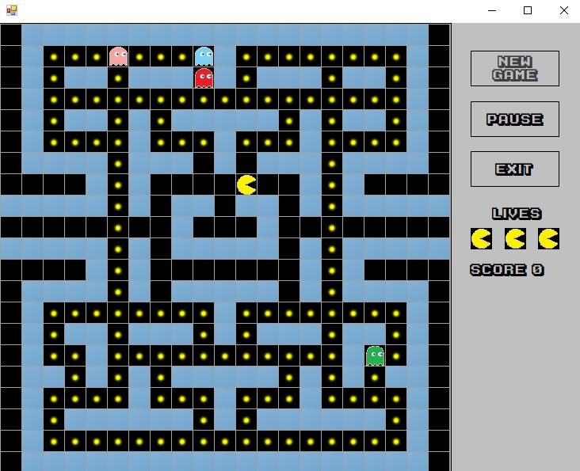

# Pac-Man
A version of the classic arcade game Pac-Man that was developed in Visual Studio using C# Window Form App (.NET Framework). This was developed as one of two main projects for the Otago Polytechnic Bachelor of Information Technology Programming 2 paper (IN511001). 

## Installation
The project source code can be launch using Visual Studio 2017 where you can use the built-in compiler to launch the game. To Launch the game without using Visual Studio, open the .exe file located in the home directory of this repo (./Pacman.exe). __Please note__ that if you launch the Pacman.exe file that is located in the home directory of this repo, the custom font for this game will not work and instead, the application will use the default font. To launch the game without using Visual Studio and use the custom font. Open the .exe file located in the directory (./Pac-Man/Pacman/Pacman/bin/Debug/Pacman.exe).

## Technologies Used  
C#  
Window Form App (.NET Framework)  
Visual Studio 2017    

### Home Screen

### Gameplay

